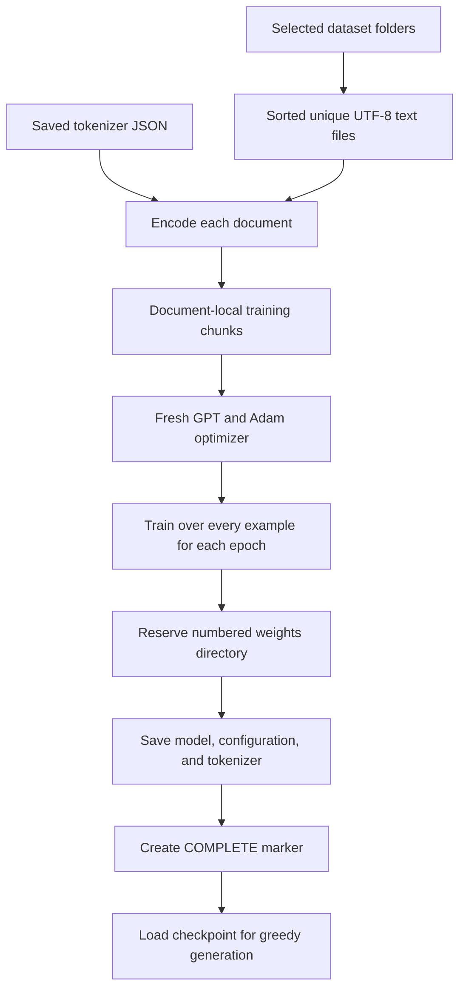

# Omega Training guide

The [Omega application](omega.md) adds a persistent Linux terminal workspace, detached workers, whole-workflow projects and experimental CUDA. See OA01 in the task board for current validation. CUDA uses resume schemas 7/8; CPU/Vulkan formats are preserved.

To estimate how long a selected dataset will take to train, use
[omega-benchmark](../Code/Rust/omega-benchmark/README.md). Its `training-time` CLI
measures bounded real updates with the same tokenizer, model and batch settings,
then projects the requested epoch count. Run on the intended hardware; preparation
is measured separately and checkpoint/evaluation overhead is excluded.

Prepared `omega-datasets` releases now have a checked ingestion path: select an
exact `base/train` or `chat/train` partition, use default format detection, and
evaluate the external validation partition separately. Completion/manifest and
selected-payload checks, partition guards and limits are documented in the
[training README](../Code/Rust/omega-training/README.md#prepared-omega-datasets-releases).

For the Docker workflow, see [Containers](../Containers/README.md). The Python
runner builds Linux CPU images, runs `omega-datasets`, prepares a tokenizer and
executes training steps with persistent dataset/checkpoint mounts. Container
paths are `/omega/datasets` and `/omega/weights`; native Windows exact-resume
compatibility with Linux containers is not promised.

For the 2026-09-30 conversation-training additions, see
[assistant execution](assistant-execution.md): opt-in chat tokenizer, chat JSONL,
assistant-only loss, a fresh SFT stage from base weights, stage resume and local
chat. The older plain-text workflow and compatibility notes below remain their
historical baseline; the companion document states new schemas and limits.

Reviewed against the source on **2026-09-27**. For the implementation inventory and
proposed next steps, see [Implementation status](implementation-status.md).

For optional Vulkan/SPIR-V training on the Intel Arc A770, see the
[GPU training guide](gpu-training.md). It documents the uniquely named
`omega-training` executable, `--features gpu`, device controls and schema-4
GPU continuation. The CPU workflows and legacy `main` commands below remain valid.

## 1. Purpose and component boundaries

Omega provides a small decoder-only GPT training workflow, with CPU defaults
and an optional GPU backend:
load a saved tokenizer, build examples from text folders, train a fresh model,
save a numbered checkpoint, and reload it for greedy generation.

It is a learning and testing foundation, not a pretrained GPT or a production
training service. The included tokenizer and datasets are smoke-test fixtures.

| Component | Responsibility | Reference |
|---|---|---|
| `omega-tokenizer` | Load/save tokenizer JSON; encode/decode text and token IDs | [README](../Code/Rust/omega-tokenizer/README.md), [library](../Code/Rust/omega-tokenizer/src/lib.rs) |
| `omega-nn` | GPT architecture, tensor validation, single-sequence training helper, greedy generation | [README](../Code/Rust/omega-nn/README.md), [model](../Code/Rust/omega-nn/src/model.rs), [library](../Code/Rust/omega-nn/src/lib.rs) |
| `omega-training` | Multi-folder dataset construction, corpus training loop, numbered checkpoint saving/loading | [README](../Code/Rust/omega-training/README.md), [library](../Code/Rust/omega-training/src/lib.rs), [CLI](../Code/Rust/omega-training/src/bin/main.rs) |

The `omega-nn train` command only trains on a literal string and does not save
weights. Use **`omega-training train`** for folder datasets and persistence.



## 2. Build and quick start

Use a current Rust toolchain with Cargo. The workspace uses Rust edition 2024;
this review verified the build with **Rust 1.93.0 on Windows**. The manifests do
not declare a minimum supported Rust version. Burn 0.18 uses its NdArray CPU
backend and autodiff by default; no GPU setup is needed for these CPU commands.

The workspace `Code/Rust/Cargo.lock` is intended to be tracked. Use `--locked`
with Cargo builds/tests to keep its dependency resolution fixed; dependency
updates should update the lockfile deliberately. This does not promise identical
floating-point results across platforms. All binary names are `main`, so a
workspace build can emit filename-collision warnings; use package-specific
`cargo run -p ... --bin main` commands to select the intended executable.
Use `--jobs 1` for workspace build/test on Windows to avoid simultaneous linker
writes to that shared filename. CLI regression tests run the same entry source
in isolated subprocess harnesses so other package builds cannot replace their
executable during a test.

After building another package, Cargo can also reuse the wrong shared executable
even with `-p`. If help lists the wrong commands, force the intended package to
relink before running it again; for the training CLI:
`cargo rustc -p omega-training --bin main --locked -- -C debuginfo=2`.
Check `train --help` for `--dataset` and `--cpu-threads` before launching a run.

Run the following commands from **`Code/Rust`**. All three crates name their
binary `main`, so always select the package with `-p`.

### Inspect the tokenizer

```sh
cp test-fixtures/wordlevel.json ../../datasets/test.json
cargo run -p omega-tokenizer --bin main -- -f test.json --test-string "hello world !"
```

The versioned fixture is `Code/Rust/test-fixtures/wordlevel.json`; the command
above makes an ignored local `datasets/test.json` for these legacy CLI examples.
It is a saved WordLevel tokenizer, **not a training corpus**.
It lowercases text, splits on whitespace/punctuation, has 13 vocabulary entries,
and maps unknown words to `[UNK]`. Decoding is not a lossless text round trip.
There is also an empty `omega-tokenizer/test.json`; the CLI does not use it for
`-f test.json`.

### Train on both included datasets

```sh
cargo run -p omega-training --bin main -- train --name foo --dataset examples/greetings --dataset examples/omega --tokenizer test.json --epochs 10
```

This selects:

- `datasets/examples/greetings/train.txt`
- `datasets/examples/omega/train.txt`

With the fixture tokenizer and default context, these contain **21 source tokens
and two training examples**, giving two optimizer updates per epoch. Output
reports file/token/example counts, live committed update counts and pre-update
losses, weighted epoch summaries, and the saved checkpoint path. `--quiet`
suppresses progress/loss output while retaining the final saved path.

If no matching checkpoint exists, this saves `weights/foo-1`. Repeating the
command saves the next number, but **trains a new model from scratch**. It does
not resume or fine-tune the previous checkpoint.

New `train` saves also contain Adam/cursor state. To continue one, use the
explicit `resume` command below; repeating `train` still starts fresh.

### Reload and generate

```sh
cargo run -p omega-training --bin main -- generate --checkpoint foo-1 --prompt "hello" --max-new-tokens 5
```

Use the directory name printed by your training command if `foo-1` already
existed. Generation loads the saved configuration and tokenizer automatically;
there is no separate tokenizer flag for this subcommand.

The output contains the **prompt plus generated tokens**. Generation chooses the
highest-logit token at each step by default. Explicit `--sample` enables seeded
temperature/top-k/top-p token sampling. There is no KV cache, and a tiny toy model
should not be expected to generate useful prose.

## 3. Command reference

Options follow their subcommand, not before it.

```sh
cargo run -p omega-training --bin main -- --help
cargo run -p omega-training --bin main -- train --help
cargo run -p omega-training --bin main -- generate --help
```

### `train`

| Flag | Default | Meaning |
|---|---|---|
| `--name` (alias `--run-name`) | Required | Prefix for numbered checkpoint directories |
| `--datasets-root` | Checkout `datasets/` | Dataset/tokenizer root; explicit relative paths resolve from the working directory |
| `--weights-root` | Checkout `weights/` | Checkpoint output root; explicit relative paths resolve from the working directory |
| `-d`, `--dataset` | At least one required | Folder under `datasets/`; repeat the flag to combine folders |
| `-f`, `--tokenizer` | `test.json` | Saved tokenizer JSON, relative to `datasets/` or absolute |
| `--epochs` | `10` | Positive number of passes over all examples |
| `--learning-rate` | `0.003` | Finite, positive Adam learning rate |
| `--context-length` | `64` | Maximum input sequence length in tokens |
| `--d-model` | `32` | Embedding and hidden width |
| `--heads` | `4` | Attention heads; must divide `d-model` evenly |
| `--layers` | `2` | Number of Transformer blocks |
| `--d-ff` | `128` | Feed-forward hidden width |
| `--seed` | `42` | Seed for Burn's shared CPU RNG |
| `--dataset-format` | `text` | Exact `.txt` files, or `jsonl` records with a string `text` field |
| `--validation-count` / `--validation-ratio` | None | Mutually exclusive whole-document split before chunking |
| `--split-seed` | `42` | Deterministic document partition seed |
| `--metrics-jsonl` | None | New output file relative to working directory or absolute; never overwrite |
| `--quiet` | False | Suppress live progress/loss output |
| `--cache` | None | Existing token cache, validated against sources/tokenizer/split/context |
| `--max-updates` | None | Positive cap for this invocation; save once at the resulting update boundary |

All architectural dimensions must be positive. Vocabulary size is derived from
the tokenizer and must have dense IDs from zero. These CLI defaults differ from
`GptConfig::default()` in `omega-nn`; the CLI constructs its own configuration.
Seeding a standalone run does not guarantee reproducibility across concurrent
library calls or different platforms/dependency versions.

Run names must be nonempty and contain only ASCII letters, digits, `-`, and `_`.
Training controls below configure batching, ordering, optimization and save
frequency. Optional GPU device/backend selection is documented in the GPU guide.

### Bounded training and explicit resume

The training CLI also accepts global `--cpu-threads N` (Rayon, 1–256) and
`--matmul-threads N` (1, 2 or 4). Omitted controls inherit defaults. New schema-3
training saves record the CPU execution profile; resume requires matching settings.
See [CPU performance and compatibility](cpu-performance.md) for startup behavior,
benchmarks, library integration and the restricted schema-1/2 migration policy.

```sh
cargo run -p omega-training --bin main -- train --name partial --dataset examples --epochs 2 --max-updates 1
cargo run -p omega-training --bin main -- resume --checkpoint partial-1 --name continued --epochs 2
```

`resume --epochs` is the **total target epoch count**, including completed epochs,
not an additional count. It must leave at least one update to perform. Optional
`--max-updates` caps this invocation too. The CLI rebuilds the saved selections,
format, split recipe and tokenizer/configuration, verifies the dataset provenance
and exact ordered examples, and restores model, Adam, counters and partial epoch
loss. There are no learning-rate, model, tokenizer or ordering overrides.
`--datasets-root` can relocate identical data; `--weights-root` selects input and
output checkpoint root. `--name` is required for the new numbered save. The input
checkpoint is never modified. Quiet mode and new-file metrics work as for train.

This continues the current NdArray f32 CPU implementation on a compatible
build/platform. Model updates have no dropout and consume no backend RNG.
Sampling uses its own versioned deterministic algorithm and saved policy/seed,
epoch and cursor; backend RNG state is not restored. Burn exposes only seeding,
not public RNG-state restoration. Cross-platform/toolchain numerical equivalence
is not promised.
Runtime checks compare available build metadata, OS and architecture; unavailable
compiler/revision fields do not prove that two separately built binaries match.
Inference-only and legacy weights-only checkpoints cannot resume.

### Periodic saves, ordering, batches and optimization

```sh
cargo run -p omega-training --bin main -- train --name scheduled --dataset examples --epochs 2 --shuffle --batch-size 2 --gradient-clip-norm 1 --warmup-updates 10 --save-every-updates 5 --save-every-epochs 1
```

`--save-every-updates N` and `--save-every-epochs N` apply to cumulative completed
counts on both train and resume. Intervals must be positive. Coincident intervals,
final saves and interruption save the same boundary only once. A final save is
retained even when no interval divides the final update. Failed writes return
nonzero and leave incomplete reservations rejected by loaders.

Ctrl+C/Ctrl+Break on Windows and SIGINT/SIGTERM/SIGHUP on Unix request a cooperative
stop. The handler only sets an atomic flag; an in-flight update and its observation
finish before checkpoint I/O on the training thread. A stop before the first update
saves initialization state. Interrupted runs report the new checkpoint and exit
nonzero unless the target was already reached. Forced termination, power loss and
backend panics cannot promise a final save; completed periodic saves remain usable.

Fresh training defaults to fixed order, batch size one, no clipping and no warmup.
`--shuffle` visits every training example once per epoch. Alternatively, repeat
`--dataset-weight FOLDER=POSITIVE_INTEGER` for every selected dataset, for example
`--dataset first --dataset second --dataset-weight first=1 --dataset-weight second=3`.
Weighted groups must be nonoverlapping and contain training examples after splitting.
Each draw picks a group by weight, then an example uniformly within it, with replacement.
`--samples-per-epoch` sets draw count (default: number of training examples).
Weighted epochs may omit/repeat examples and have different target totals. Validation
documents are excluded. Shuffle and weights are mutually exclusive; `--seed` controls
initialization and independently derived epoch orders. Sampling stores one index per
epoch draw plus group metadata, even with cached token sources.

`--batch-size` bounds examples per update; the last partial batch is kept.
`--max-batch-tokens` caps rows times longest input length, including padding
(default 65536). Oversized batches fail without truncation. Right-padding masks
attention and loss; filler ID zero is an ignored storage value, not an assumed
tokenizer special token. Labels shift exactly once and never cross examples.
Each batch loss and the epoch summary weight real targets, excluding padding.

`--gradient-clip-norm` clips all parameter gradients by one global L2 norm.
`--warmup-updates W` uses `base_lr * min((completed_updates + 1) / W, 1)`;
zero disables warmup. Gradients, candidate model parameters and Adam moments are
validated before committing an update. Numerical failure leaves the prior state
unchanged and stops the run. One minibatch is one optimizer update; there is no
gradient accumulation. Resume restores these settings without overrides. Sampling,
batching and optimizer options are saved in resume schema 3 (including the schema-2 controls).

### Token-cache preparation and use

```sh
cargo run -p omega-training --bin main -- prepare-cache --dataset examples --context-length 64 --output ../../example-cache
cargo run -p omega-training --bin main -- train --name cached --dataset examples --context-length 64 --cache ../../example-cache --epochs 2
```

`prepare-cache` requires a new output directory and shares dataset/tokenizer,
format, context and validation flags with `train`. `train --cache` and
`resume --cache` use indexed cache examples without materializing all chunks.
Keep the same context/split/format/limit settings used to create it. Opening checks
source membership and raw byte hashes, full tokenizer identity, settings, schema,
manifest completion and token-file integrity. Changed inputs are stale-cache
errors; create a new cache explicitly. There is no automatic overwrite/rebuild.
The source root may move if relative names and bytes remain identical.

Cache-only limits are available on prepare-cache/train/resume (train/resume use
them only with `--cache`; eager loading ignores them): `--max-source-bytes`,
`--max-document-tokens`, `--max-documents`, `--max-directory-entries` and
`--max-manifest-bytes`. Defaults are shown in `--help`. They must be positive,
with at least two document tokens; oversized input fails, never truncates.
The source-byte cap covers an entire text or JSONL file, and JSONL parsing retains
that file's raw records. The token cap is checked after encoding, so tokenizer
scratch/output may exceed it before rejection. Cache preparation processes bounded
source files and documents and retains capped index metadata. Manifest parsing
adds allocation overhead beyond serialized bytes; these are input/count limits,
not a process RSS guarantee. Indexed reads
retain at most one capped token document plus a chunk; each read verifies its
token-file checksum. This bounds corpus storage, not tokenizer scratch or model
tensor memory, and repeated chunks can reread/hash the same document. It is not
an arbitrary-size streaming tokenizer. Optional batching adds its own bounded
collation buffers; sampling adds epoch indices and group metadata.

### `generate`

| Flag | Default | Meaning |
|---|---|---|
| `--checkpoint` | One selection required | Single checkpoint directory name under `weights/`; conflicts with `--latest-run` |
| `--latest-run` | None | Highest completed numeric suffix for this run, using inference selection |
| `--weights-root` | Checkout `weights/` | Root containing checkpoints; explicit relative paths resolve from the working directory |
| `--prompt` | Required | Text that must encode to at least one token |
| `--max-new-tokens` | `8` | Maximum appended tokens; zero returns the encoded prompt |
| `--eos-token-id` | None | Stop after generating this valid vocabulary ID |
| `--sample` | False | Explicitly enable request-local token sampling |
| `--temperature` | `1` with sampling | Finite positive softmax temperature; requires `--sample` |
| `--top-k` | None | Keep at most K tokens, with K in 1..=vocabulary size; requires `--sample` |
| `--top-p` | None | Smallest nonempty nucleus reaching P in (0,1] after top-k; requires `--sample` |
| `--sampling-seed` | `42` with sampling | Request-local seed independent of initialization/training; requires `--sample` |

The entire prompt plus requested token budget must fit the saved context length,
even if EOS might stop generation early. An EOS already in the prompt does not
stop generation. A newly generated EOS is included in the returned IDs. The CLI
decodes with special tokens retained; no EOS or other special-token IDs are
invented. `--checkpoint` takes an exact name, not a path or a special `latest`
alias. Select the separate `--latest-run` option for numeric latest discovery.

Sampling performs a stable temperature softmax, sorts descending with token-ID
tie breaking, applies top-k, and measures top-p against the remaining normalized
mass. It then renormalizes retained probabilities for one request-local draw.
The portable PRNG/version is documented by `GENERATION_SAMPLING_ALGORITHM` in
`omega_nn::generation`; token selection does not consume Burn or training sampler
state. A fresh library model may materialize lazy parameters on first forward,
which uses the existing initialization RNG; loaded/trained models are already
materialized.
Identical logits/options reproduce draws, but cross-platform numerical identity
is not promised. Greedy keeps existing backend argmax tie behavior. Both modes
reject nonfinite logits, and sampling-only flags without `--sample` are errors.

### Read-only checkpoint discovery

```sh
cargo run -p omega-training --bin main -- checkpoints list --weights-root ../../weights --run foo --json
cargo run -p omega-training --bin main -- checkpoints latest --run foo --mode resume --json
cargo run -p omega-training --bin main -- generate --latest-run foo --prompt "hello" --sample --top-k 5 --sampling-seed 42
```

`checkpoints list` reports metadata status/reasons for one run's entries;
`checkpoints latest` defaults to `--mode inference` or accepts `--mode resume`.
Both support `--weights-root`, `--json`, `--max-entries` (100000) and
`--max-metadata-bytes` (16 MiB). The entry cap counts unrelated root entries too;
the byte cap bounds aggregate headers per candidate, not model loading or process
RSS. `--run` is required and obeys the existing safe run-name rules.

Statuses are `complete_inference`, `resumable`, `legacy_unverified`, `incomplete`
and `invalid`. JSON includes absolute paths and an `inspection` value of
`metadata_only_payloads_unverified`. Metadata inspection does not initialize
tensors or certify tokenizer/model payloads or runtime/dataset compatibility.
Legacy saves can be selected for inference under the existing load policy.

Latest chooses the highest eligible numeric suffix, never modification time.
Incomplete entries are skipped with reasons; resume also skips inference-only
entries. Equal-number aliases are ambiguous. Corrupt completed candidates fail
instead of selecting an older save. Selection does not override actual loader
errors: corrupted weights or incompatible resume state fail without fallback.

`generate`, `evaluate` and `resume` require exactly one of `--checkpoint NAME`
and `--latest-run RUN`; the latter uses default catalog limits and prints selection
and skipped-entry diagnostics to stderr. Exact-name loading retains its existing
behavior. Catalog paths reject symlinks/escapes (all Windows reparse points,
including some cloud placeholders) and assume a trusted weights root;
normal loading revalidates the selected checkpoint, but the scan is not an atomic
snapshot against concurrent mutation. Commands never delete or repair checkpoints,
and do not change numbering, checkpoint schemas or durability guarantees.

### Evaluation and tokenizer commands

```sh
cargo run -p omega-training --bin main -- train --name heldout --dataset examples --validation-count 1 --metrics-jsonl run-metrics.jsonl --epochs 2
cargo run -p omega-training --bin main -- evaluate --checkpoint heldout-1 --dataset examples --validation-count 1
cargo run -p omega-training --bin main -- train-tokenizer --dataset examples --output ../../datasets/byte-bpe.json --vocab-size 512 --min-frequency 2
cargo run -p omega-training --bin main -- coverage --tokenizer byte-bpe.json --text "Hello world!"
```

Use the checkpoint name actually printed. Training evaluates the fixed current
model after each epoch when validation is nonempty. `evaluate` loads the saved
tokenizer and weights; without split flags it evaluates every selected document.
With split flags it evaluates only the deterministic validation partition. Use
the original selections/policy/seed to reproduce membership, or supply a separate
held-out folder. Arbitrary supplied data is not automatically certified held-out.
Explicit zero validation in `evaluate` is an empty-set error.

Evaluation reports target count, natural-log mean cross entropy and its
exponential (perplexity), weighting targets across unequal chunks. Empty/invalid
data, nonfinite logits/loss and perplexity overflow fail explicitly. Weights,
optimizer and RNG are unchanged. Chunk length changes context and may change
metrics; these fixed-model metrics differ from pre-update training summaries.

`train-tokenizer` shares corpus discovery with training and accepts
`--datasets-root`, repeated `--dataset`, and `--dataset-format text|jsonl`.
It trains case-preserving byte BPE, all 256 byte entries, without normalization,
prefix-space injection, BOS/EOS, padding or truncation. `--vocab-size` defaults to
8192 (minimum 256, an upper bound); `--min-frequency` defaults to 2 (positive).
`--output` is required and must be a new path with an existing parent. Existing
files are never overwritten; an I/O failure can leave a partial new file.
Save and freeze the resulting IDs: retraining is not promised deterministic and
a new vocabulary is incompatible with old weights. Training is eager/in-memory.

`coverage` requires `--tokenizer` and literal `--text`, accepts `--datasets-root`
and optional `--unknown-token-id`. It prints schema-1 JSON with `token_count`,
`unknown_count` and `unknown_rate`. Unknown metrics are null without an explicit
ID (existence checked; meaning is the caller's responsibility); an empty encoding
has no defined rate. Encoding does not request special tokens; actual padding
and configured truncation are rejected. Byte BPE has no unknown ID: complete byte
coverage does not measure efficient segmentation or language-model quality.

### Structured progress

`JsonlMetrics<W: Write>` is a configurable library writer with no stdout side
effects. CLI `--metrics-jsonl` flushes one schema-1 JSON record per event:
`training_started`, `update`, optional epoch-end `validation`, then
`training_complete`. Update records include epoch, example index, completed
updates/targets, target count and pre-update loss; epoch-end fields carry the
target-weighted mean and count (otherwise null). Validation records contain
fixed-model mean cross entropy, target count and perplexity. Epochs are one-based,
example indices zero-based. Completion means training/evaluation finished, not
successful completion of the entire command; check exit status and `COMPLETE`.

Logging failures abort further updates and return a nonzero exit; the last
observed update is already committed in memory. The CLI does not save after a
logging failure. Partial runs retain emitted records, possibly an incomplete last
line that consumers must reject. Dropping the library writer emits no completion.
Resume starts with `training_resumed`, including saved cumulative counters and
the next example index. An intentional `--max-updates` stop short of target emits
`segment_complete` instead of `training_complete`; a cooperative stop emits
`training_interrupted`. CLI terminal events follow the final checkpoint save;
earlier valid saves remain if later metrics writing fails. Update counters continue
across resumes. Update records additionally include `example_count`,
`effective_learning_rate`, global pre-clipping `gradient_norm` and `clipped`.
Example indices now identify draw positions within the epoch order. Started-event
target totals describe the first planned epoch; weighted later epochs can differ.

## 4. Paths and dataset preparation

Default roots are anchored to the checkout location at **compile time**, through
`CARGO_MANIFEST_DIR`, rather than to the shell's current directory:

```text
Omega/
  Code/Rust/
    omega-tokenizer/
    omega-nn/
    omega-training/
  datasets/
    test.json
    examples/greetings/train.txt
    examples/omega/train.txt
  weights/
    .gitkeep
    foo-1/
```

Moving only the compiled binary will not relocate these defaults. Override them
with `train --datasets-root PATH --weights-root PATH` and
`generate --weights-root PATH`. Absolute roots work independently of the shell's
current directory; explicit relative roots are relative to that directory.
Dataset selections remain safe relative names inside the selected dataset root.
Tokenizer paths remain relative to that root or absolute. `--checkpoint` remains
a single directory name inside the weights root. Library root parameters are
always explicit.

To use your own data, create named directories beneath `datasets/` and put one
UTF-8 text document in each `.txt` file. Select a directory by its relative name,
using `/` for nested names even on Windows. Selecting `examples` also selects
both included subfolders recursively.

Rules implemented by [the dataset builder](../Code/Rust/omega-training/src/dataset.rs):

- The default `text` format reads exact lowercase `.txt`; explicit `jsonl` reads
  exact lowercase `.jsonl`. Other files are ignored; JSON arrays/CSV/archives are
  unsupported. Formats are never guessed from content.
- Every selected folder must contain at least one file of the selected format. File paths,
  absolute selections, `..` traversal, backslashes, and drive syntax are rejected.
- Paths are sorted and deduplicated across overlapping or repeated selections.
  Dataset flag order does not control training order. This is path deduplication,
  not duplicate-content detection or dataset balancing.
- Blank documents are skipped. A nonblank document producing fewer than two
  tokens is an error. At least one training example must remain overall.
- Symlinks are rejected, including inspected ancestors and recursively encountered
  entries. This assumes a stable filesystem, not protection against hostile
  concurrent changes.
- Encoding does not request added special tokens. Empty encodings, reported
  truncation overflow, and actual padding (zero attention-mask entries) are
  rejected. Merely having padding/truncation configured is not itself an error
  if neither affects the encoding. Disable those settings for predictable corpus
  building; the builder performs its own chunking.

The helper can reject only overflow reported by the tokenizer. Tests found that
tokenizers 0.23 can stop between pre-tokens without returning overflow; therefore
do not rely on this check to detect every saved truncation policy. Disable saved
truncation when preparing corpora. Regression fixtures separately exercise actual
padding and reported overflow without changing the saved pipeline.

For real training, choose or train a suitable tokenizer (see `train-tokenizer`)
and freeze its vocabulary before training model weights. The fixture
will turn most real-world words into `[UNK]`; it is not a production vocabulary.

JSONL requires one JSON object per physical line, with a required string `text`.
Extra fields are ignored; missing/non-string text and malformed JSON produce
file/line errors; invalid UTF-8 identifies the file. Blank lines and blank text are skipped, preserving
physical 1-based line numbers. Each nonblank record is a separate document,
identified by `relative/file.jsonl/@record-N`; this is a logical ID, not a path to
open. Absolute source paths remain the real JSONL file. Records split before
chunking and never create cross-record targets; train/validation may contain
different records from one file. Reordering records changes identity. Duplicate
content is not detected. `TrainingSet.files` lists unique contributing files.
Tokenizer training's raw loader accepts short texts; model training/evaluation
still require each nonblank encoded document to contain at least two tokens.

### Chunking and label alignment

For context length `3`, a document `[a, b, c, d, e, f]` becomes:

```text
Chunk 1: [a, b, c, d]    input: [a, b, c]    targets: [b, c, d]
Chunk 2: [d, e, f]       input: [d, e]       targets: [e, f]
```

Chunks contain at most `context_length + 1` tokens and share one boundary token.
Every adjacent target pair appears once per epoch; short final chunks are kept.
Chunks never join different documents. Context and learned positions restart for
each chunk; chunks do not carry hidden state or the full preceding document.
No EOS target is automatically added at a document boundary.

`TrainingSet.token_count` counts source tokens without counting overlap twice.
For contributing documents, targets per epoch equal source tokens minus the
number of documents; optimizer updates per epoch equal the number of chunks.

### Library document splitting

`load_document_corpus(root, folders, tokenizer)` retains whole tokenized documents
with root-relative path IDs and absolute source paths. Then call
`split_document_corpus(&corpus, context_length, policy, seed)` to obtain training
and validation `DocumentPartition`s. Each partition contains a `TrainingSet` and
document metadata mapping IDs to ranges of examples. Assignment happens before
chunking, so no document appears in both partitions and every adjacent target pair
remains in its document's partition.

`ValidationSplit::Count(n)` selects exactly n contributing documents;
`Ratio(r)` requires a finite ratio in `[0, 1)` and selects `floor(count * r)`.
A positive ratio rounding to zero is an error, as is any count leaving training
empty. `None`, `Count(0)`, and `Ratio(0.0)` explicitly allow empty validation.
Blank documents do not count. `build_training_set` preserves all-training behavior.

Membership uses a fixed seeded FNV-1a/SplitMix64 identity ranking, independent of
selection order and context length. Moving the root preserves membership; adding
or renaming documents can change it. IDs are paths, not content fingerprints, so
duplicate text at different paths is not deduplicated. Non-UTF-8 path portability
is limited to the same platform; CLI provenance requires UTF-8 paths. For JSONL,
use `load_document_corpus_with_format(..., DatasetFormat::Jsonl)`; the old loader
retains Text behavior. `load_text_documents(root, folders, format)` exposes raw
documents for tokenizer preparation using the same path safety and identities.

## 5. Model and optimization behavior

The model uses learned token/absolute-position embeddings, pre-normalized causal
multi-head attention, GELU feed-forward layers, residual connections, a final
layer normalization, and an untied vocabulary projection. Raw output logits have
shape `[batch, sequence, vocabulary]`.

Default training holds all tokenized examples in memory; `--cache` uses indexed
disk examples. Both use the same trainer with saved ordering/batching options.
One model and Adam optimizer persist across updates and epochs. Defaults retain
document/chunk order and one example per update. Optional validation runs after
epochs; there is no validation-based early stopping.

Labels shift once in the unpadded loop or padded collation. Each update minimizes
mean next-token cross entropy over its real targets. The epoch summary weights
each pre-update batch loss by its number of targets:

```text
epoch_loss = sum(batch_loss * batch_target_count) / total_target_count
```

This is a training summary over changing model states, **not** validation loss or
a final-model evaluation. Token weighting applies to the reported metric; each
batch still gets one optimizer step regardless of its target count. Non-finite
losses, gradients, candidate parameters and Adam moments fail before committing
the update. Snapshot saving also validates state before publishing a resumable save.

The CLI saves at configured intervals and after a segment or cooperative stop.
Attention memory grows
quadratically with sequence length; increasing dimensions can exhaust memory.

### Persistent library sessions

`TrainingSession::new(config, owned_set, learning_rate, seed)` validates the entire
set once and initializes one model and Adam optimizer. `step()` trains the next
batch (one example by default). `advance_updates(count, observer)` can be called repeatedly, including
across epoch boundaries, without resetting model, optimizer, or counters. Zero
updates is a no-op. The immutable set is owned by the session; clones share that
data while forking model, optimizer, counters, cursor, and partial epoch metrics.

Each post-update `UpdateEvent` reports the one-based epoch, zero-based example
index, completed updates/targets, example target count, and pre-update loss. The
last update of an epoch also carries a target-weighted `EpochSummary`.
`progress()` exposes completed epochs and the next example index; the index and
partial-epoch target count reset to zero at an epoch boundary. Observers see the
already-committed state and may call `inference_model()` for a snapshot. Observer
failure stops further updates but does not roll back or replay the last event;
the caller is responsible for retrying failed observer work.

Checkable update errors leave optimizer/cursor unchanged; tensor/backend panics
remain possible. Numerical checks validate gradients and candidate state too.
`train` keeps its existing signature and results by copying its borrowed dataset
into this session and collecting epoch summaries. Direct session use avoids that
copy. `TrainingSession<S: ExampleSource = TrainingSet>::from_source` supports
indexed sources through the same update loop. The trait supplies fallible indexed
examples/target counts and an ordered-example SHA256 identity. Constructors scan
all examples for validity using bounded working storage for cached sources.
Initialization seeding uses Burn's shared RNG; the current update path has no
dropout or other backend-random operations. Use `from_source_with_options` and
`SessionOptions` for sampling, bounded batching and clipping/warmup. The next
example index is a draw cursor; `updates_per_epoch()` counts minibatches and
`epoch_target_count(epoch)` accounts for sampled targets. Restore/save counter
validation replays weighted epoch orders, so work grows with completed epochs.
Use `save_training_checkpoint`/`load_training_checkpoint`
for verified disk continuation, not the inference-only checkpoint helpers.

## 6. Checkpoint layout and numbering

[Checkpoint implementation](../Code/Rust/omega-training/src/checkpoint.rs):

| File | Contents |
|---|---|
| `model.mpk` | Burn `NamedMpkFileRecorder` model record using full precision |
| `config.json` | `vocab_size`, `context_length`, `d_model`, `num_heads`, `num_layers`, `d_ff` |
| `tokenizer.json` | The tokenizer used with these weights |
| `manifest.json` | Schema 1, authoritative model configuration, tokenizer SHA256 and provenance |
| `COMPLETE` | Exact `omega-checkpoint-v1` plus newline, written last |

Numbering is **maximum existing numeric suffix + 1**, starting at one:

| Existing entries | Run name | New directory |
|---|---|---|
| None matching | `foo` | `foo-1` |
| `foo-1`, `foo-2` | `foo` | `foo-3` |
| `foo-1`, `foo-5` | `foo` | `foo-6` |
| `Foo-2` | `foo` | `foo-3` |
| `bar-99`, `foo-backup` | `foo` | `foo-1` |

Scanning compares run prefixes case-insensitively. Files as well as directories
occupy suffixes; leading zeros count numerically. Suffix overflow is an error.
Numbers are derived only from current entries: deleting the highest checkpoint
can allow that number to be reused later. New names are ASCII lowercase, so
`Foo` and `foo` both reserve `foo-N`; legacy mixed-case names remain discoverable
and are not renamed.

Directory creation is atomic and collisions trigger rescanning. Canonical names
make concurrent case variants share one numbering series even on case-sensitive
storage. All concurrent writers must use this policy; older binaries can still
race by writing a different casing. A failed save may leave
a numbered directory without `COMPLETE`; it still occupies its suffix and will
not load. Do not manually add the marker to make a partial save appear complete.

Checkpoint loading validates configuration and dense tokenizer vocabulary size,
then loads the record and checks its architecture against the configuration.
Saving checks model/config compatibility before reserving a directory. Generation
performs the same check before tensor work. The model accessor inspects parameter
shapes and attention metadata without changing the legacy record layout. Legacy
records omit primitive head-count metadata, so loading still trusts the config
for that value; these checks do not authenticate historical provenance or
historical tokenizer semantic identity in unversioned records.

Schema 1 verifies every config field and SHA256 of the entire effective tokenizer
pipeline (compact JSON, recursively sorted object keys, array order preserved)
before tensor initialization. Swapped IDs or changed preprocessing fail even when
vocabulary size agrees. Unknown schemas and missing fields/files fail. Legacy
checkpoints with an empty `COMPLETE` and no manifest remain loadable; removing a
manifest from a versioned checkpoint fails rather than downgrading silently.

CLI provenance includes selected folders, format, split policy/seed and partition
membership, each complete document's token-ID SHA256 (`token-ids-le-u32-v1`,
concatenated little-endian u32 IDs, not raw source bytes), epochs/learning rate/
seed/optimizer, package/version and compile-time Cargo.lock SHA256. New builds
record the compiler and target; revision is supplied `OMEGA_BUILD_REVISION` or an
explicit `source-sha256:` identity. Legacy nullable fields remain readable, but
exact resume rejects a different/unknown build; keep the original executable for
existing runs. Library `save_checkpoint_with_metadata`
accepts known metadata; compatible `save_checkpoint` writes null provenance.
All metadata is written before completion, never patched into a finished save.
Hashes detect saved-pipeline mismatch; they do not authenticate historical
relationships between arbitrary caller-supplied weights, data and tokenizer.

The existing `save_checkpoint`/`save_checkpoint_with_metadata` APIs remain
**inference-only**. `train`, `resume`, and `save_training_checkpoint` additionally
write `optimizer.mpk`, `resume.json` and its `resume.sha256` before `COMPLETE`.
Resume schema 3 records configuration/tokenizer/source identity, default Adam
settings, cumulative update/epoch/target counters, next example index, initialization
seed, exact f64 learning-rate/partial-loss bits and supported runtime/RNG policy.
It hashes model and optimizer bytes and validates restored optimizer parameter
IDs, ranks, shapes, moments and step counters. Missing/corrupt state or incompatible
source/config/tokenizer/settings/runtime fails before an update. The shared
inference loader can still generate from these snapshots without using Adam.
Schema 2 also requires sampling algorithm/options, batching bounds and optimization
settings. Schema-1 training snapshots migrate to fixed order, batch size one and
disabled controls. Migration permits the prior recorded Cargo.lock digest
`ce271dcacbe04b5f92fb0336b17fea24c663a4008b7a4522caf76efcc344ac1e`
or the current digest, with other runtime checks unchanged; arbitrary old build
hashes are rejected. Schema-1/2 migration additionally requires unset CPU pool
environment variables and default kernels, assuming the historical run used that
environment on the same host. New schema-3 snapshots require the current build
identity and matching CPU execution profile. See
[CPU checkpoint compatibility](cpu-performance.md#checkpoint-compatibility).

Source identity hashes a domain tag, ordered example count, each chunk length
(little-endian u64) and token IDs (little-endian u32). Identical eager/cache inputs
share identity; paths and descriptive metadata are separate. CLI resume also
compares the original document/partition provenance. Snapshot integrity hashes
are not signatures, and completion is not a power-loss durability guarantee.
Only load trusted compatible checkpoints; model/Burn changes may require migration.

Generated directories under `weights/` are ignored by Git; only `.gitkeep` is
retained. Back up wanted weights separately.

## 7. Library API map

Import these from `omega_training`; helper functions return `Result<_, String>`
unless noted otherwise.

| API | Contract |
|---|---|
| `project_root()` | Returns the compile-time checkout root as `PathBuf` |
| `build_training_set(root, folders, tokenizer, context_length)` | Returns `TrainingSet { examples, files, token_count }`; contributing file paths are sorted and absolute |
| `load_document_corpus(root, folders, tokenizer)` | Returns complete documents with root-relative IDs before splitting/chunking |
| `split_document_corpus(corpus, context_length, policy, seed)` | Returns disjoint training/validation partitions with document-to-example ranges |
| `evaluate(model, config, set)` | Fixed-model target-weighted cross entropy, count and perplexity |
| `JsonlMetrics::new(writer)` | Caller-owned versioned metrics sink, write errors propagated |
| `train(config, set, epochs, learning_rate, seed)` | Returns `TrainingResult { model, epoch_losses }`; initializes a fresh CPU model |
| `TrainingSession::new(config, owned_set, learning_rate, seed)` | Owns one fresh model, persistent Adam state, immutable data and update/epoch progress |
| `session.step()` / `session.advance_updates(count, observer)` | Continue from the next example and expose committed update/epoch events |
| `save_checkpoint(weights_root, run_name, model, config, tokenizer)` | Consumes the inference model and returns the newly saved directory path |
| `load_checkpoint(path)` | Returns `(Gpt<Cpu>, GptConfig, Tokens)` from a completed directory |
| `reserve_run_directory(weights_root, run_name)` | Reserves an empty numbered directory; does not write a checkpoint or a completion marker |
| `checkpoint_catalog::discover_checkpoints(root, run_name, limits)` | Bounded read-only metadata inventory; payloads and resume compatibility remain unverified |
| `catalog.latest(CatalogMode::Inference/Resume)` | Selects one numeric candidate and reports skips; never retries an older save after load failure |

Use `omega_nn::encode_text` and `omega_nn::generate` with the model/config/tokenizer
returned by `load_checkpoint`. Unlike the CLI, the library loader accepts an
explicit checkpoint path. For sampling use `omega_nn::generate_with_options`
with `GenerationOptions::Sample(SamplingOptions)`; the original `generate` remains
greedy. Avoid calling `reserve_run_directory` before
`save_checkpoint`: the latter reserves its own directory.

## 8. Troubleshooting

| Symptom | Likely cause and next action |
|---|---|
| Tokenizer load/JSON error | Use a valid saved tokenizer JSON, not a corpus or the empty crate-local `test.json` |
| Dataset folder contains no selected files | Check dataset root, lowercase extension and explicit `--dataset-format` |
| Path rejected | Use a named relative directory with `/`, no traversal, and no symlinks |
| No training examples / fewer than two tokens | Supply nonblank documents encoding to at least two IDs |
| Padding or truncation error | Use a tokenizer configuration that emits unpadded, untruncated documents |
| Non-finite loss | Try a smaller learning rate and inspect inputs/model dimensions; the failed run is not saved |
| Prompt plus budget exceeds context | Shorten the prompt or lower `--max-new-tokens`; loading does not expand the trained context |
| Incomplete checkpoint | Check that the save succeeded; use another complete checkpoint or rerun training |
| Many `[UNK]` tokens or poor output | The fixture vocabulary/model is tiny; tokenizer coverage and meaningful held-out training are still needed |
| Run appears quiet | Check `--quiet`; otherwise each completed update prints progress, but large updates can take time |

Returned CLI errors use a nonzero exit code. Direct low-level tensor APIs may
panic on invalid shapes; prefer the checked helpers.

## 9. Validation and source maintenance

From `Code/Rust`:

```sh
cargo fmt --all --check
cargo test --workspace --locked --jobs 1
cargo clippy --workspace --all-targets --locked -- -D warnings
```

See [implementation status](implementation-status.md) and the current task-board
handoff for actual validation results and platform limits. Prior test counts do
not validate subsequent edits. Tests use temporary roots and bounded CPU models.

Update this guide when changing CLI defaults, dataset formats, checkpoint files,
or training semantics. See [Implementation status](implementation-status.md) for
test coverage, remaining work, and the full review scope.
