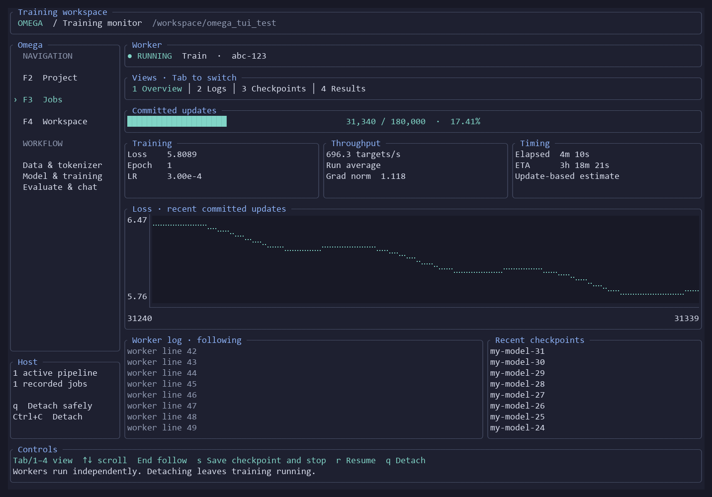

# Omega persistent training application

Omega is a Linux x86-64 executable with a Ratatui terminal interface and independent
background workers. It contains the existing Rust libraries, so no source checkout,
Python installation, sibling executables or Rust installation is needed to use a
release binary. It does not provision machines or install GPU drivers.

After base training, see [post-training usage](post-training.md) for schema-2
configuration, readiness, bounded SFT/evaluation, human scoring and explicit
checkpoint promotion. The same workflow is available in the TUI and through
`omega post-training`; real data and quality acceptance remain separate gates.



The preview uses test data. Its pane layout is inspired by the
[openapi-tui demo](https://github.com/zaghaghi/openapi-tui/blob/main/static/demo.gif).

## Installation and compatibility

The [release workflow](github-builds.md) builds downloadable artifacts on pushes
to `main`; publishing a version tag is a separate action that creates a GitHub Release.
From a published release, download `omega-VERSION-linux-x86_64.tar.gz` and `SHA256SUMS` from a tagged GitHub
release, verify the checksum, extract it and run `chmod +x omega`. Run `./omega
doctor --backend cpu`, then `./omega`. Release CI targets Ubuntu 22.04 (glibc 2.35)
using Rust 1.93.0 and the pinned CUDA 12.5.1 Ubuntu 22.04 build image. Newer compatible
Linux systems are supported subject to hardware qualification. Windows native
workers are unsupported; use Linux/WSL.

The all-backend release includes CPU, Vulkan and **experimental CUDA**. Vulkan
requires a supported discrete GPU and working Vulkan drivers. CUDA requires an
NVIDIA GPU, compatible driver, CUDA toolkit headers for runtime kernel compilation,
and dynamically loadable CUDA driver/NVRTC libraries
(CUDA 12.5–12.9 NVRTC; Blackwell needs 12.8 or newer within that range). `omega doctor --backend cuda` reports device UUID, driver/NVRTC and
execution identity. Set `CUDA_PATH` to the toolkit root if headers are not in a
standard location; `include/cuda_runtime.h` must exist. Header contents are part
of the exact-resume identity. CUDA 13 NVRTC is incompatible with these Burn 0.18 bindings; a newer driver is fine when a compatible CUDA 12 NVRTC runtime is selected. CUDA loading is deferred until explicitly selected; missing
CUDA libraries do not prevent opening the TUI or using CPU. Device selection never
silently falls back. CUDA is f32, fusion disabled, with host numerical checks.

The host must remain running and permit background processes after SSH logout.
Host administrators may terminate user sessions and their processes at logout;
Omega cannot override that policy. A reboot or worker crash requires a manual
checkpoint resume. Multi-GPU, remote desktop control, machine provisioning and
automatic reboot recovery are outside this version.

## Projects and configuration

Start in a directory browser. Use arrows and Enter to browse; `w` enters a working
directory, `o` opens a model file, `c` creates `model.toml` in the current directory,
and `i` imports a dataset recipe into a new project. Recent projects appear below
the directory entries. Existing files are never replaced by create/import.

The versioned project file starts with `omega_schema_version = 1`. It is separate
from the unchanged `omega-datasets` recipe schema. Import copies the recipe into
`[dataset.recipe]` and leaves the original untouched. All relative data, tokenizer,
cache and checkpoint paths resolve from the directory containing the chosen
`model.toml`; no compile-time checkout paths are used by Omega.

Minimal project using existing text and a saved tokenizer:

```toml
omega_schema_version = 1
name = "first-model"

[paths]
datasets = "datasets"
weights = "weights"

[dataset]
selections = ["corpus"]
format = "auto"

[tokenizer]
path = "tokenizers/tokenizer.json"
vocab_size = 8192
min_frequency = 2
chat_protocol = true

[model]
context_length = 128
d_model = 128
heads = 4
layers = 4
d_ff = 512

[training]
backend = "cpu" # "vulkan" or "cuda" when compiled in
device = 0
epochs = 10
learning_rate = 0.003
batch_size = 2
save_every_updates = 100
save_every_epochs = 1

[pipeline]
prepare_dataset = false
prepare_tokenizer = false
prepare_cache = false
benchmark = false
train = true
evaluate = false
```

Common settings are available in forms; Enter edits a field, Ctrl+S validates and
saves, and Esc returns. The TOML editor supports arrows, Home/End, Enter, Backspace
and Delete. Form edits preserve TOML comments. Conflicting on-disk edits are rejected.
Unknown fields and invalid dimensions/rates/batching are rejected before saving.

Use `prepare_tokenizer = true` for a new byte-BPE tokenizer, with chat controls
enabled when assistant training is intended. Existing prepared tokenizers require
matching input/settings/identity receipts to be reused automatically; explicitly
select an existing tokenizer with preparation disabled when no receipt exists.
Token IDs are never guessed or replaced. The tokenizer screen inspects identity
and vocabulary and supports `e` encode / `d` decode.

`prepare_dataset` requires an imported recipe. Review resolves the exact remote
revision and file list before downloading. Existing releases are reused only when
their recipe and completion/hash manifests verify. Set `dataset.cache` to an
explicit path before selecting cache preparation; chat token caches are unsupported.

Optional sections:

```toml
[assistant]
selections = ["corpus/release/chat/train"]
epochs = 3
learning_rate = 0.0003

[benchmark]
samples = 12
warmup = 2
max_seconds = 60.0

[evaluation]
selections = ["corpus/release/base/validation"]
format = "auto"
```

Assistant training runs only when explicitly configured. It uses a compatible
parent checkpoint, the parent's exact tokenizer and masked conversation targets.
Select a checkpoint for standalone assistant, resume, evaluation, generation or
chat actions. The chat action uses the saved chat protocol. On a completed chat job, `c` continues
the accepted conversation and `n` starts a new conversation. History is retained in
job records for reconnection; excessive context is rejected without truncation.
Set `[inference] max_new_tokens = 64` and optional `system` in TOML to configure
the response budget and system message. An untrained model can produce a rejected
control token.
Benchmarks project fixed-order training, so disable shuffled sampling for that
stage. Benchmarks are estimates of compute time, excluding checkpoint/download time.

## Review, workers and recovery

Start Training first shows the resolved stages, download plan, backend, model,
configuration and output locations. Enter launches the reviewed configuration;
Esc returns. Only selected stages run. A `training.max_updates` bounded segment
saves and stops the pipeline; it does not proceed into assistant/evaluation stages
as if the requested training epochs had finished.

The interface has a persistent navigation sidebar on terminals at least 100 columns
wide. `F2` opens the project action menu, `F3` opens Jobs / reconnect, and `F4` opens
the workspace browser. Project actions and configuration fields show a details pane
when space permits. Narrow terminals hide secondary panes; text editing retains
its normal key bindings. Form rows show their current values.

The job monitor has four views, selected with `Tab`, `Shift+Tab`, or `1`–`4`:

- **Overview:** worker status/stage, committed-update progress, loss, epoch,
  learning rate, gradient norm, average targets/second, elapsed time and ETA,
  recent loss chart, log tail and checkpoint names.
- **Logs:** the bounded worker-log tail. Up/PageUp moves into older retained
  output; Down/PageDown moves toward the end. `End` returns to following new output.
  Long log lines are clipped to one terminal row.
- **Checkpoints:** the latest complete checkpoint and up to 100 recent saves,
  including their full paths. Arrow/page keys scroll. Use the project's checkpoint
  inventory to select a checkpoint for an operation.
- **Results:** generated text, chat/evaluation results and worker errors. `c`
  continues a completed chat and `n` starts a new one, as on the other job views.

Unknown metrics display a dash. Throughput is the current run's average; ETA uses
the current run's update rate and the remaining update count. It is an approximate
training-stage estimate, excluding later pipeline stages and future save overhead.
Stopped/completed/failed jobs do not show a running ETA. The loss chart uses up to
240 samples from the latest 256 KiB of the event journal; it is recent history,
not the entire training curve. Logs retain at most 32 KiB in the UI. Presentation
data refreshes with status polling, not on every frame. Reading the dashboard
does not change worker state or query GPU utilization.

`q` or Ctrl+C is **Detach**. `s` on the job dashboard is **Save checkpoint and stop**:
it requests a committed update boundary, waits for the checkpoint's `COMPLETE`
marker, then records stopped status. During non-training preparation, stop is
cooperative between stages. Disconnecting the TUI never blocks worker progress.

Reopen Omega and choose Jobs / reconnect to view the same worker. Only one compute
pipeline per user per host can run, across all projects/state roots; competing
training, benchmark and inference launches return an actionable error. Other
projects remain browsable. Existing non-Omega training processes are outside this
lock, so avoid launching competing work manually.

Host-local state is `$XDG_STATE_HOME/omega` or `$HOME/.local/state/omega` (explicit
absolute `OMEGA_STATE_DIR` is available for testing). Job directories contain the
frozen config, status, bounded event journal and worker log. Executable copies are
retained under their SHA-256 hash. Linux locks and private Unix sockets live under
`/tmp/omega-UID`, never in an SMB project. Keep state on a local filesystem; project
datasets/tokenizers/checkpoints can use an explicitly mounted share. Credentials
such as `HF_TOKEN` are inherited from the launching environment, never copied into
the project config or snapshots. Do not put credentials in prompts or paths.

Workers run in an independent session with redirected standard streams. Ownership
uses boot ID and process start time as well as PID; stale records cannot authorize
control of an unrelated process. An unexpected exit is shown as failed/interrupted,
with the latest complete checkpoint available for recovery. No completion is
reported before the final operation/save verifies.

To resume, select the job/checkpoint and choose Resume. When a job record identifies
the checkpoint, Omega uses its retained executable rather than a newer downloaded
binary. Keep those executable copies and records. Exact resume validates build,
backend/device identity, optimizer, corpus, tokenizer, sampling and configuration.
New build provenance records compiler/target and an explicit source fingerprint
(or supplied release revision), so old exact resumes require their original
executable. Legacy inference/catalog readers and CPU/Vulkan resume schemas are preserved; CUDA uses schema 7 for base training and
8 for assistant training. Cross-backend or incompatible-build exact resume is
rejected. Legacy weights remain usable for compatible inference or a new stage;
a weights-only load is never presented as exact resume.

Headless helpers:

```sh
omega init model.toml
omega plan model.toml
omega start model.toml --yes
omega jobs
omega status JOB_ID
omega stop JOB_ID
omega resume model.toml weights/MODEL-N --yes
```

`start --yes` is explicit approval of the resolved pipeline. `stop` acknowledges
the request, not successful saving; inspect the final job status/checkpoint.
Keep original standalone executables for already-running training sessions.
