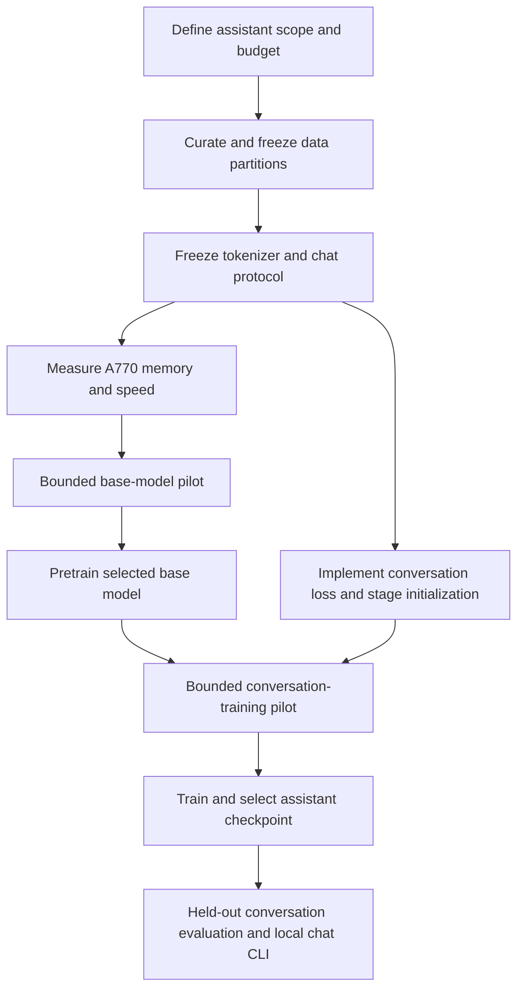

# Zero to hero: train an Omega conversational assistant from scratch

Planning date: **2026-09-30**. Target confirmed by the user: **a conversational
assistant trained from random weights on one 16 GB Intel Arc A770, with bounded
pilot runs first**. This is a roadmap, not a claim that the model is trained or
that the missing chat features already exist. Execution tasks and acceptance
criteria are in [TASKS.md](TASKS.md).

**Implementation update:** the conversation software work described as missing in
this planning baseline is implemented and regression-tested on CPU and the A770.
Use [assistant execution](Docs/assistant-execution.md) for current commands,
schema compatibility and explicit remaining corpus/hardware/training gates.
The baseline below explains the intended stages; it is not live completion status.

## 1. What we are building

The first deliverable is a small assistant that can answer short questions and
follow short conversations within a defined subject/language scope. We need to
choose that scope and measurable quality targets before spending substantial
training time. A broad, reliable general-purpose assistant is a later ambition;
this hardware and this codebase do not establish that it is achievable within
any particular budget.

There are two training stages:

1. **Base pretraining:** initialize Omega's GPT randomly and learn next-token
   prediction from a curated text corpus. This teaches language patterns.
2. **Supervised conversation training (SFT):** start from our own base weights
   and train on demonstrations of good assistant responses. This teaches roles,
   instruction following, conversation context and when to end a reply.

Both stages use our model; neither requires importing another model's pretrained
weights. A tokenizer supplies text-to-ID mappings, not language-model knowledge.
The separation between language modeling and instruction training is supported
by the supervised demonstration stage in the
[InstructGPT paper](https://arxiv.org/abs/2203.02155). Its later human-feedback
reinforcement learning is outside this first milestone.



## 2. What Omega already supplies, and what is missing

| Area | Available now | Work needed for this goal |
|---|---|---|
| Model | Configurable causal GPT, learned absolute positions, CPU/Vulkan f32 | Measure a feasible configuration; architectural replacement is not a prerequisite. |
| Tokenizer | Saved full pipelines and case-preserving byte BPE | Explicit, versioned role/turn tokens and shared chat formatting; freeze before model initialization. |
| Corpus | Text/JSONL text fields, document splits, chunking, bounded caches | Source audit, content deduplication, grouped train/validation/test partitions and conversation schema. |
| Training | Adam, shuffle/mixing, padded batches, clipping/warmup, numerical checks | Assistant-only target masks through batching, evaluation, identity and resume. |
| Persistence | Numbered saves, periodic/interruption saves, compatible exact resume | An explicit new training stage from our base weights, with a fresh optimizer and recorded parent checkpoint. |
| Evaluation | Next-token loss/perplexity and metrics | Fixed conversational prompts, response-quality rubric, turn/context tests and checkpoint comparison. |
| Inference | Greedy or sampled generation and explicit EOS ID | Chat history formatting, reply stopping, assistant-only display and clear context-limit behavior. |

The existing `masked_cross_entropy` primitive can ignore arbitrary target
positions. The current training pipeline does **not** expose assistant-only loss:
its source supplies token sequences, and the trainer uses real-token validity
for both attention and loss. These masks need different meanings for SFT.
User/system tokens remain visible context while their target positions are
excluded from the training objective. Even batch size one must use the new
target mask; its current fast path otherwise trains every target.

`train` always starts fresh. `resume` restores the original optimizer, data and
settings; it cannot switch from a pretraining corpus to a conversation corpus.
Neither is presently a command for starting SFT from a base checkpoint.

Source references: [trainer](Code/Rust/omega-training/src/trainer.rs),
[batching](Code/Rust/omega-training/src/batching.rs),
[masked loss](Code/Rust/omega-nn/src/loss.rs),
[tokenizer training](Code/Rust/omega-tokenizer/src/training.rs), and
[resume](Code/Rust/omega-training/src/resume.rs).

## 3. Define success and protect the evaluation data — ZH01, ZH02

Write down the language, subjects, expected answer lengths and conversation
lengths. Assemble a fixed development prompt set covering direct questions,
simple instructions, follow-up questions, correction of earlier statements,
unknown answers and reply termination. Agree a scoring rubric and pass thresholds
before comparing models. Keep a separate final test set closed during tuning.

Prepare two datasets: general/domain text for base pretraining, and conversations
with useful assistant demonstrations for SFT. Record source, permitted use,
language, extraction method and source-group identifiers. Remove broken text,
repeated headers, unusable records and unwanted sensitive material. Review actual
samples rather than assuming that a large text dump is a good corpus. The PDF
utility extracts embedded text only; scanned documents need separate OCR work.

Split by document/source group **before** tokenizer training and chunking. Detect
exact duplicates and review near-duplicate groups before assigning partitions.
Keep related editions, passages from one original document, and related
conversation variants in the same partition. Audit overlaps across both base
and SFT data so evaluation answers do not enter pretraining through another file.
Omega's current path-based deduplication cannot perform this content audit.

A proposed layout, created under a new versioned directory, is:

```text
datasets/assistant-v1/
  base/train/          # supported .txt or text-field JSONL
  base/validation/
  base/test/
  chat/train/          # future explicit conversation format
  chat/validation/
  chat/test/
  tokenizer.json      # finalized only after ZH03
```

Keep raw originals elsewhere and write preparation outputs to new paths. Record
partition membership and content hashes in a corpus manifest. Do not point the
recursive training selector at `assistant-v1` or `base`: that would include
validation/test descendants. Select `assistant-v1/base/train` explicitly.

For this layout, current commands can train only on the training folder and
evaluate the external validation folder between saved segments. Current
automatic epoch validation instead splits the selected corpus; it does not
accept a separate validation-folder argument. The proposed experiment workflow
will coordinate external evaluation without silently training on it.

**Exit gate:** a reviewed, reproducible corpus release with disjoint groups,
data-quality samples, counts and untouched final evaluation partitions.

## 4. Freeze the tokenizer and conversation contract — ZH03

Train byte BPE on training partitions only. Compare a few modest vocabulary
sizes, for example 4,096 and 8,192 entries, as pilot candidates. Measure tokens
per byte/word, length distributions and representative Unicode round trips.
Token-level perplexity is not directly comparable across different tokenizers;
keep tokenizer identity fixed when comparing model runs, or add a consistently
defined per-byte evaluation. Byte coverage alone does not measure efficiency.

Before any lasting base run, define an explicit conversation protocol: supported
roles, message order, role boundaries, end-of-turn and end-of-conversation
semantics, and the assistant-generation prefix. Choose whether document endings
in base training receive an explicit end token. Test that exact policy; current
chunking does not insert one automatically.

Reserve/register the required special tokens through a new opt-in tokenizer
configuration. One shared formatter must serve dataset preparation and inference.
Define how literal delimiter strings inside user content are escaped or encoded
so they cannot accidentally become role boundaries. Never guess numeric IDs or
reuse a different model's special-token conventions. Do not alter `test.json`
or existing tokenizers. Save the final pipeline and protocol version together.

The existing tokenizer command creates byte BPE with **no** special tokens. A
tokenizer made today can be used for disposable experiments, but the final chat
tokenizer requires ZH03. Adding tokens after pretraining changes the vocabulary
contract and is outside this plan's no-resize policy.

**Exit gate:** immutable tokenizer and protocol artifacts with tests for encode,
decode, save/reload, delimiter collisions, role order and stop-token handling.

## 5. Establish a real hardware and time budget — ZH04

Use release builds and the unique `omega-training` binary. The documented A770
qualification was on Linux with Mesa 26.1.8-arch1.1. The present Windows checkout
does not establish Windows GPU qualification. Record the actual intended host,
driver, toolchain and build before a pilot; exercise the hardware regressions
there. See [GPU training](Docs/gpu-training.md).

An **unbenchmarked starting candidate**, not an approved final model, is an
approximately 5.3-million-parameter GPT with vocabulary near 4,096, width 256,
4 layers, 4 heads, FF width 1,024 and context 256. Exact vocabulary and parameter
counts must be measured. Start at batch 1; measure batch 2/4 only if memory
allows. Context 256 is short for chat. Try 512 before freezing the model if the
chosen conversations require it and the measured budget permits it.

These numbers are experiment seeds, not a quality or memory-fit promise. Omega
has separate embedding/output weights, f32 training, Adam state, gradients,
candidate copies and host synchronization. Parameter storage alone substantially
understates training memory. Attention grows quadratically with context, and
full logits grow with batch, context and vocabulary. The GPU preflight checks
individual buffers, not aggregate peak VRAM.

Measure warmed, checked updates on representative tokenized documents, then
measure complete pilot segments including validation and checkpoint I/O. Record
real targets/second, padded positions, peak host memory, available device-memory
measurements, checkpoint size/time, failures and competing workload. Record
whether a device-memory reading is a sample or a true peak.

Budget arithmetic should use measured throughput:

```text
base target exposures per full fixed/shuffled epoch = sum(document_tokens - 1)
estimated update time = planned target exposures / measured targets_per_second
total elapsed estimate = update time + measured evaluation/save/setup overhead
```

An explicit document-end token changes token counts. Weighted sampling changes
epoch exposure totals. For SFT, report input tokens and assistant loss targets
separately: a masked user token still consumes compute. Epochs are repeated
exposures, not new unique data. Report unique corpus tokens as well as exposures.

For scale, 10 million targets at an assumed 1,000 targets/s take about 2.8 hours
of updates; at 100 targets/s they take about 27.8 hours. These are arithmetic
examples, **not Omega measurements**. Existing A770 benchmarks used different
dimensions and synthetic IDs; do not extrapolate a finish date from them.

**Exit gate:** a recorded model/context/batch choice and bounded update, elapsed
time and disk budgets. Fix the tokenizer, architecture and runtime before the
main run. A changed architecture starts a different run; exact resume does not
resize a model or accept changed training settings.

## 6. Make experiments reproducible — ZH05

Record each run's corpus/tokenizer/protocol hashes, dimensions, initialization
seed, build/runtime identity, backend, data order, learning rate, batch limits,
warmup/clipping, planned target exposures, stopping criteria and save cadence.
Retain exact commands, structured metrics, checkpoint paths and evaluation
results. Use new run names and log paths; never overwrite an earlier experiment.

Use a tiny overfit test to detect implementation problems, then a representative
pilot with disjoint validation. Compare validation using the same tokenizer,
context, target policy and partition. Inspect generation throughout. Falling
training loss alone is not an acceptance criterion.

Select the best checkpoint using the agreed validation results, not the highest
checkpoint number. Catalog/latest only selects recency by numeric suffix and
does not score model quality. Keep the selected checkpoint name/hash in the
experiment report so later saves cannot change what is evaluated or released.

## 7. Implement the conversation training path — ZH06, ZH07

The new loader must accept explicitly versioned role/content message records;
ordinary `{"text":"..."}` JSONL must keep its current behavior. Preserve the
conversation as the unit of splitting. Include prior user/system/assistant
messages as causal context and compute loss on the designated assistant replies
and their terminating tokens only. Shift targets once, including at boundaries.

For the first implementation, reject over-context training conversations with
actionable counts/length diagnostics. Prepare shorter conversations explicitly;
do not silently cut off answers or split them into chunks that lose their prompt.
Any later windowing policy needs its own coverage tests. Reject examples with no
assistant targets, and keep padding excluded from attention and loss.

Carry the target mask into dataset identity, batches, training, evaluation,
metrics and exact continuation. Existing token-only identities cannot detect a
changed assistant-loss policy. Version affected schemas and retain explicit
legacy all-target behavior. Initially reject conversation caching clearly if
mask-aware caches are not implemented; do not reuse text caches incorrectly.

Add an explicit operation to initialize a **new stage** from a compatible Omega
checkpoint: preserve the model/tokenizer, choose new SFT data and training
settings, initialize fresh Adam/sampler/counters, and record the parent artifact
and stage. Preserve the parent. Existing exact `resume` continues each stage
with its own unchanged settings; it must not become an implicit stage switch.
No external pretrained import, vocabulary resize or backend-resume bypass is
part of this task. Final CLI/API names will be agreed during implementation.

**Exit gate:** CPU and qualified A770 tests prove correct masks (including batch
1), causal prompt influence, zero direct loss gradient at ignored logits,
unchanged base behavior, parent preservation and interrupted/uninterrupted
continuation equivalence for the new stage.

## 8. Train in gates, not one large unattended run — ZH08–ZH11

| Gate | Work | Evidence required before proceeding |
|---|---|---|
| Base pilot (ZH08) | Random initialization, small real corpus, bounded updates; save/resume/reload | Finite updates, compatible continuation, held-out improvement and a feasible measured budget. |
| Base run (ZH09) | Fresh approved run or exact continuation of a compatible pilot | Budget honored, validation/checkpoint comparison, stable selected base artifact. |
| SFT pilot (ZH10) | New optimizer from selected base; bounded conversation training | Improved development conversation scores versus base, correct stopping and no unacceptable base-language regression. |
| Assistant run (ZH11) | Continue the accepted SFT configuration within an approved budget | Selected checkpoint meets predeclared validation criteria; complete provenance and recovery evidence. |

Use periodic saves and bounded segments. A cooperative signal lets the current
update finish before saving; forced termination is not equivalent. Exercise
recovery on temporary pilot outputs before relying on it for a long run. Keep
the same GPU runtime/build profile for exact resume. Copy important completed
artifacts to a separate backup location and verify a restore; `COMPLETE` is not
a power-loss or backup guarantee.

If the pilot learns only memorized responses, validation worsens, throughput is
too low, or memory is exhausted, stop and revise the corpus or configuration.
Changing data/settings requires a new compatible stage/run, not edited checkpoint
metadata. A failed gate remains failed; additional epochs are not automatically
the remedy. Learning-rate decay or gradient accumulation may help a measured
problem, but their implementation is conditional work (ZH14).

## 9. Make it usable and evaluate the actual assistant — ZH12, ZH13

Provide a local terminal chat command using the frozen formatter, tokenizer and
stop rules. Decode/display the new assistant reply rather than the entire input
prompt. Keep the role/turn delimiters out of normal output. Retain history only
within the trained context. Initially return a clear context-full message and
offer an explicit reset; do not silently discard turns or claim unlimited memory.

After choosing the checkpoint with validation, run the sealed test set once and
publish the result, including failures. Evaluate answer relevance, instruction
following, multi-turn consistency, grammar, repetition, uncertainty behavior,
role leakage, correct turn endings, latency and context limits. Use a written
human scoring rubric and retained outputs; no paid external judge is required.
Assistant-target perplexity is useful alongside these scores but cannot replace
them. A failed final test is reported honestly; tuning afterward requires a fresh
held-out evaluation plan.

Package the selected model, exact tokenizer/protocol, configuration, provenance,
usage command, measured resource requirements and a short model card describing
data, intended use, limitations and held-out results. Verify offline reload and
chat on the supported runtime, and verify recovery from the backup. The first
release is a local artifact, not an automatic public upload or hosted service.

## 10. Commands that exist today

Run these from `Code/Rust`. They are references for future execution, not commands
run while writing this roadmap. Data must first be prepared and a run budget
agreed. New output paths need existing parents; use unique output names.

```sh
cargo build -p omega-training --bin omega-training --release --features gpu --locked --jobs 1
cargo run -p omega-training --bin omega-training --release --features gpu --locked -- devices
cargo run -p omega-training --bin omega-training --release --features gpu --locked -- train --help
cargo run -p omega-training --bin omega-training --release --features gpu --locked -- resume --help
```

A **disposable tokenizer experiment**, without chat special tokens:

```sh
cargo run -p omega-training --bin omega-training --release --locked -- train-tokenizer --dataset assistant-v1/base/train --output ../../datasets/assistant-v1/tokenizer-candidate.json --vocab-size 4096 --min-frequency 2
```

Rebuild/select the GPU feature set before subsequent Vulkan commands; do not run
different builds concurrently against the same executable. Once ZH03 has produced
the final `tokenizer.json`, a proposed **20-update base smoke test** is:

```sh
cargo run -p omega-training --bin omega-training --release --features gpu --locked -- train --backend vulkan --device 0 --name assistant-base-pilot --dataset assistant-v1/base/train --tokenizer assistant-v1/tokenizer.json --context-length 256 --d-model 256 --heads 4 --layers 4 --d-ff 1024 --batch-size 1 --shuffle --learning-rate 0.0003 --gradient-clip-norm 1 --warmup-updates 10 --epochs 1 --max-updates 20 --save-every-updates 10 --metrics-jsonl base-pilot-01.jsonl
```

These learning settings are starting hypotheses; 20 updates check plumbing and
speed, not convergence or conversational quality. This plain-text smoke command
uses today's no-injected-document-EOS behavior; if ZH03 selects a different base
boundary policy, replace this recipe with the implemented explicit option before
the lasting run. It is not an SFT command.

Capture the actual saved name and substitute it for `CHECKPOINT_NAME`:

```sh
cargo run -p omega-training --bin omega-training --release --features gpu --locked -- evaluate --backend vulkan --device 0 --checkpoint CHECKPOINT_NAME --dataset assistant-v1/base/validation
cargo run -p omega-training --bin omega-training --release --features gpu --locked -- resume --backend vulkan --device 0 --checkpoint CHECKPOINT_NAME --name assistant-base-pilot --epochs 1 --max-updates 20 --save-every-updates 10 --metrics-jsonl base-pilot-02.jsonl
```

That resume example requires work remaining before the one-epoch target. If the
first segment already completed the epoch, raise the total target only within
the agreed budget. Resume inherits the saved learning rate, dimensions, data and
batch settings. Pin exact checkpoint names for comparisons; concurrent runs must
use distinct names. Conversation preparation, stage initialization and chat CLI
commands are intentionally absent here until ZH06/ZH07/ZH12 implement them.

## 11. Work that is useful later, but does not block the first assistant

- T20.2/T20.4: finish detailed projection/loss, transfer, validation, allocation
  and checkpoint-I/O profiling. Reuse these tasks; do not invent a second GPU backend.
- T21.2/T21.3: KV caching and streamed replies. They improve inference usability;
  they do not teach the model to converse. Existing scope needs an explicit GPU
  extension before claiming A770 cached/streamed parity.
- T22.2–T22.4: stronger load bounds, payload integrity, durable publication and
  retention previews. Verified manual backups are still needed in the first run.
- ZH14: optional learning-rate decay, accumulation or other measured training
  improvements, each with saved-state compatibility and numerical tests.
- Mixed precision, distributed training, external pretrained import, preference
  optimization, retrieval/tools, web serving and a graphical UI are separate
  future scopes. No downloads, paid compute or large jobs follow from this plan.

Small-model research supports beginning with a deliberately constrained task:
[TinyStories](https://arxiv.org/abs/2305.07759) demonstrates learning on a restricted
story distribution, not general assistant capability. Likewise,
[compute-optimal training research](https://arxiv.org/abs/2203.15556) motivates
balancing model size and data, but its large-scale experiments are not a fixed
tokens-per-parameter prescription or time estimate for this Omega/A770 setup.

The next executable planning task is **ZH01**: specify the assistant's first
language/domain, quality thresholds, actual GPU host and maximum pilot budget.
Then complete the data/tokenizer/budget gates before scheduling substantial work.
